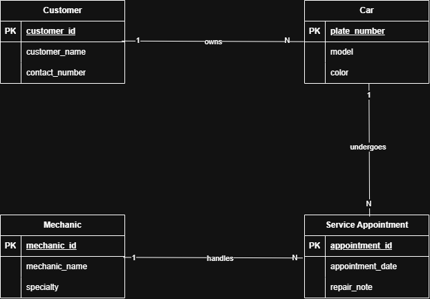

# INFOMAN1 – Week 2 Lab: Conceptual ERD Case Study
**Name:** Geoff Benedict P. Cariño
**Student ID:** 2511028
**Section:** BSIT - II

## Task 1 — Candidate Entities

| Entity | Justification |
|---|---|
| Customer | The scenario states "the shop has many customers," and each customer has their own identity and cars, so it is a distinct entity. |
| Car | The scenario says "each customer may bring in one or more cars," and a car has its own model, plate number, and color. |
| Mechanic | The scenario says "the shop employs several mechanics, each with a name and a specialty," so a mechanic is a distinct thing with its own attributes. |
| Service Appointment | The scenario says a mechanic works on a car "during a scheduled service appointment," and each appointment has its own date and repair note. |

**Excluded as attributes (descriptive nouns):** model, plate number, color, name, specialty, date, repair note. These only describe an entity and have no attributes of their own. "Shop" is the system's context, not something we store records about.

## Task 2 — Attributes per Entity

### Customer
- Primary Key: customer_id
- Attributes:
  - customer_id — Domain: numeric, auto-generated
  - customer_name — Domain: text
  - contact_number — Domain: text (digits only)

### Car
- Primary Key: plate_number
- Attributes:
  - plate_number — Domain: text (unique, e.g. "ABC 1234")
  - model — Domain: text
  - color — Domain: text

### Mechanic
- Primary Key: mechanic_id
- Attributes:
  - mechanic_id — Domain: numeric, auto-generated
  - mechanic_name — Domain: text
  - specialty — Domain: text (e.g. engine, brakes, electrical)

### Service Appointment
- Primary Key: appointment_id
- Attributes:
  - appointment_id — Domain: numeric, auto-generated
  - appointment_date — Domain: date
  - repair_note — Domain: text (short)

## Task 3 — Relationships

| Relationship (verb phrase) | Between | Cardinality | Checked both directions? |
|---|---|---|---|
| owns | Customer ↔ Car | 1:N | Yes — one customer may own many cars, but each car "belongs to exactly one customer." |
| services | Mechanic ↔ Car | M:N | Yes — one mechanic works on many cars over time, and one car may be serviced by different mechanics on different visits. |
| handles | Mechanic ↔ Service Appointment | 1:N | Yes — one mechanic handles many appointments, but each appointment is handled by one mechanic. |
| undergoes | Car ↔ Service Appointment | 1:N | Yes — one car can have many appointments over time, but each appointment is for one car. |

## Task 4 — Conceptual ERD

The M:N "services" relationship is shown through Service Appointment, which holds the date and repair note.