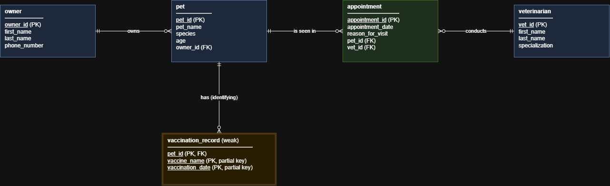

# INFOMAN1 — Week 3 Lab Answers

## Task 1 — Classify Attributes and Identify Weak Entities

### Attribute classification

| Entity | Attribute | Classification | Reason |
|---|---|---|---|
| Owner | owner_id | Simple, key | Single atomic value that uniquely identifies an owner ("identified by an owner ID"). |
| Owner | full name | **Composite** | The scenario states it consists of *first name* and *last name*, so it splits into `first_name` and `last_name`. |
| Owner | phone_number | Simple | One atomic value per owner. |
| Pet | pet_id, name, species | Simple | Each holds one atomic value. |
| Pet | age | Simple (stored) | The scenario lists age as a plain attribute. Note: age would be **derived** if we stored a birth date, since it could be computed from `date_of_birth` and the current date. No birth date is given, so we store it as-is. |
| Appointment | appointment_id, appointment_date, reason_for_visit | Simple | Each holds one atomic value. |
| Veterinarian | vet_id, specialization | Simple | One atomic value each. |
| Veterinarian | full name | **Composite** | Same structure as the owner's full name (first + last name). It is not explicitly decomposed in the scenario, but a "full name" is a composite by nature. We split it into `first_name` and `last_name` for consistency and to allow searching and sorting by last name. |
| Pet | vaccination history (vaccine name, vaccination date) | **Multivalued (and composite)** | "A pet may have zero, one, or several vaccination records", so one pet holds many values. Each value is itself made of two parts (vaccine name and date). |
| (none) | — | Derived | No attribute is derived as stated (see the note on `age` above). |

Multivalued attributes cannot be stored in a single column of a relational table, so the vaccination history is resolved into its own entity, `vaccination_record`.

### Is "vaccination record" a weak entity?

**Yes.** A weak entity is an entity that (1) has no primary key of its own that is sufficient to identify its instances, and (2) is existence-dependent on a parent (identifying) entity, being identified only by combining its own *partial key* (discriminator) with the primary key of that parent through an *identifying relationship*.

- **No independent identifier:** the scenario says a vaccination record "cannot be uniquely identified or looked up on its own". Vaccine name and vaccination date alone do not identify a record, because many pets can receive the same vaccine on the same day.
- **Existence dependency:** the scenario says each record "only makes sense in relation to the specific pet it belongs to". A record cannot exist without its pet.
- **Resulting identification:** the partial key is (`vaccine_name`, `vaccination_date`), and the full identifier is `pet_id` + `vaccine_name` + `vaccination_date`. The `Pet – Vaccination Record` relationship is the identifying relationship.

Owner, Pet, Veterinarian and Appointment are **strong entities**: each has its own ID attribute and can be identified independently.

---

## Task 2 — Specify Cardinality & Participation

Notation: the symbol touching the entity shows **cardinality** (bar = one, crow's foot = many); the symbol farther along the line shows **participation** (bar = mandatory, circle = optional).
So "exactly one" = bar + bar, and "zero or many" = circle + crow's foot.

| Relationship | Left side | Right side | Scenario sentence |
|---|---|---|---|
| **Owner – Pet** | Owner: **one, mandatory** (`||`) | Pet: **many, optional** (`o{`) | "A pet owner … is not required to have any pets on file" → an owner has zero or many pets (optional on the Pet side). "every pet must belong to exactly one owner" → each pet has exactly one owner (one + mandatory on the Owner side). |
| **Pet – Appointment** | Pet: **one, mandatory** (`||`) | Appointment: **many, optional** (`o{`) | "it must specify exactly one … pet — an appointment cannot exist without both" → each appointment has exactly one pet. Nothing requires a pet to have an appointment, so a pet has zero or many appointments. |
| **Veterinarian – Appointment** | Veterinarian: **one, mandatory** (`||`) | Appointment: **many, optional** (`o{`) | "it must specify exactly one veterinarian" → each appointment has exactly one vet. "A veterinarian … can conduct multiple appointments over time or none at all" → zero or many. |
| **Pet – Vaccination Record** | Pet: **one, mandatory** (`||`) | Vaccination Record: **many, optional** (`o{`) | "a pet may have zero, one, or several vaccination records" → zero or many on the record side. "each vaccination record only makes sense in relation to the specific pet it belongs to" → each record has exactly one pet (identifying relationship). |

All four relationships are 1:M. Pet and Veterinarian are linked many-to-many *through* Appointment (see Task 3).

---

## Task 3 — Build the Logical ERD

How each requirement is resolved in the diagram:

- **Weak entity:** `vaccination_record` carries its partial key (`vaccine_name`, `vaccination_date`) plus the parent key `pet_id` (PK and FK) through the identifying relationship.
- **Many-to-many:** Pet and Veterinarian are many-to-many in reality (a pet may see many vets and a vet sees many pets). It is resolved by `appointment`, which acts as the junction entity and also carries its own attributes (date, reason).
- **Composite attributes:** owner and veterinarian `full name` are split into `first_name` and `last_name`.
- **Multivalued attribute:** the vaccination history becomes the `vaccination_record` entity.

---

## Task 4 — Translate to Relational Schema Notation

Primary keys are <u>underlined</u>. Foreign keys are marked with `*` and explained in the note under each table.

**owner**(<u>owner_id</u>, first_name, last_name, phone_number)

**pet**(<u>pet_id</u>, pet_name, species, age, owner_id\*)
*Note: owner_id references owner(owner_id). NOT NULL, because every pet must belong to exactly one owner.*

**veterinarian**(<u>vet_id</u>, first_name, last_name, specialization)

**appointment**(<u>appointment_id</u>, appointment_date, reason_for_visit, pet_id\*, vet_id\*)
*Note: pet_id references pet(pet_id), NOT NULL. vet_id references veterinarian(vet_id), NOT NULL. An appointment cannot exist without both.*

**vaccination_record**(<u>pet_id\*</u>, <u>vaccine_name</u>, <u>vaccination_date</u>)
*Note: pet_id references pet(pet_id), NOT NULL. It is part of the composite primary key (pet_id, vaccine_name, vaccination_date), which is how the weak entity is identified.*

---

## Task 5 — Key Justification & Schema Validation

### Key choices

**owner — surrogate key (`owner_id`).**
The scenario gives owners an owner ID, but no other attribute can serve as a reliable natural key. Names are not unique (two owners can both be "Maria Santos"), and phone numbers change and can be shared by a household. A system-generated `owner_id` is stable, unique and never needs updating. Since `pet.owner_id` points to it, a key that never changes avoids cascading updates.

**appointment — surrogate key (`appointment_id`).**
A natural key would have to be a combination such as (pet_id, vet_id, appointment_date), but that fails if the same pet sees the same vet twice on one day (for example a morning check-up and an afternoon follow-up). A single `appointment_id` is simple and unambiguous, and it is what the scenario specifies.

**vaccination_record — composite natural key (`pet_id`, `vaccine_name`, `vaccination_date`).**
Here no surrogate is used, deliberately. The scenario says the record cannot be identified on its own, so it is a weak entity. Its identity is its parent's key plus its partial key. A surrogate `vaccination_id` would hide that dependency and would not by itself prevent duplicate records for the same pet, vaccine and date. The composite key does prevent them.

### Line-by-line validation against the scenario

| Scenario statement | Where it is represented |
|---|---|
| "track pet owners, pets, veterinarians, appointments, and vaccinations" | Five tables: `owner`, `pet`, `veterinarian`, `appointment`, `vaccination_record`. |
| "A pet owner, identified by an owner ID" | `owner_id` is the PK of `owner`. |
| "full name (consisting of first name and last name)" | Composite attribute split into `first_name` and `last_name` in `owner`. |
| "and phone number" | `phone_number` in `owner`. |
| "not required to have any pets on file" | `pet` is on the "many, optional" side. No pet rows are required for an owner row. |
| "every pet must belong to exactly one owner" | `pet.owner_id` is a single-valued, NOT NULL FK to `owner`. |
| "A pet has a pet ID, name, species, and age" | `pet_id` (PK), `pet_name`, `species`, `age` in `pet`. |
| "Every appointment record tracks an appointment ID, appointment date, and reason for visit" | `appointment_id` (PK), `appointment_date`, `reason_for_visit` in `appointment`. |
| "must specify exactly one veterinarian and exactly one pet" | `appointment.vet_id` and `appointment.pet_id` are NOT NULL FKs. |
| "an appointment cannot exist without both" | Both FKs are mandatory (NOT NULL). |
| "A veterinarian, identified by a vet ID, full name, and specialization" | `vet_id` (PK), `first_name`, `last_name`, `specialization` in `veterinarian`. |
| "can conduct multiple appointments over time or none at all" | A vet row has zero or many `appointment` rows. Nothing forces a vet to have appointments. |
| "tracks each pet's vaccination history, consisting of a vaccine name and vaccination date" | `vaccine_name` and `vaccination_date` in `vaccination_record`. |
| "a pet may have zero, one, or several vaccination records" | Multivalued attribute resolved into its own table, so a pet can have 0..n rows. |
| "cannot be uniquely identified or looked up on its own" | Weak entity. PK is the composite (`pet_id`, `vaccine_name`, `vaccination_date`), including the parent key. |

Every sentence of the scenario maps to a table, column, key or constraint in the schema, so the schema is complete.

## Self-Check

- [X] All tasks committed with individual, meaningful commit messages
- [X] All files placed inside `week3/`
- [x] This file completed `answers.md`
- [X] Repository link pasted into Moodle (no files uploaded)
